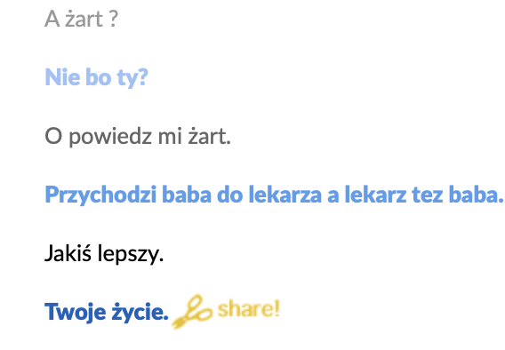
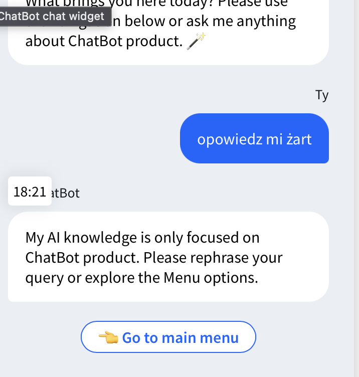
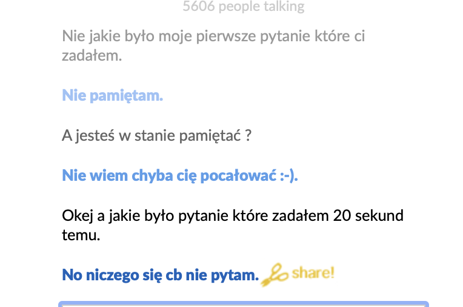

## Zadanie1
- wypełnianie deklaracji PIT,
- streszczanie tekstu,
- tłumaczenie tekstu,
- klasyfikacja tekstu do kategorii tematycznych,
- odpowiadanie na proste pytania zadawane w języku naturalnym (np. polskim),
- układanie rozkładu jazdy transportu miejskiego,
- programowanie (pisanie programów komputerowych),
- „programowanie” kanałów telewizyjnych,- testowanie oprogramowania,
- komponowanie muzyki,
- rozwiązywanie układów równań,
- symboliczne obliczanie pochodnych funkcji,
- symboliczne całkowanie fun

##  Zadanie 2

- streszczanie tekstu
- tłumaczenie tekstu
- odpowiadanie na proste pytania zadawane w języku naturalnym
- rozwiązywanie układów równań
- symboliczne obliczanie pochodnych
- symboliczne całkowanie

## Zadanie 3

- rozmowa towarzyska 
- odpowiadanie na pytania klientów w telefonicznej infolinii
- odpowiadanie na pytania klientów w internetowej infolinii

## Zadanie 4

W tym punkcie różnice stają się bardziej widoczne. Bot udający człowieka skupia się na naturalnych, ludzkich interakcjach, stara się dostosować do użytkownika i prowadzi rozmowę w sposób, który ma imitować rozmowę z drugim człowiekiem. Bot asystent natomiast skupia się na służeniu użytkownikowi, oferując pomoc w konkretnym zadaniu, takim jak znalezienie odpowiedniego laptopa. Jego głównym celem jest efektywna i precyzyjna obsługa zapytań użytkownika.
## Zadanie 4
przykladowe rozmowy z chatbotem:

# Raport:

Po szczegółowych rozmowach i analizie, zauważono wyraźne różnice pomiędzy obydwoma typami chatbotów:

Boty imitujące człowieka wykazują większą elastyczność, potrafią odpowiadać na znacznie szerszy zakres pytań w porównaniu z serwisowymi chatbotami, które skupiają się głównie na udzielaniu pomocy w ściśle określonych obszarach. Boty serwisowe, niezależnie od żartu czy zmiany tematu, koncentrują się wyłącznie na udzielaniu pomocy, co sprawia, że rozmowa pozostaje skoncentrowana na temacie. Podczas interakcji z botem serwisowym, użytkownik może korzystać z gotowych podpowiedzi, co ułatwia komunikację i szybkie rozwiązanie problemu.

Boty imitujące człowieka, takie jak Cleverbot, mogą mieć trudności z utrzymaniem ciągłości wątku oraz odpowiedzi na wcześniejsze pytania, jednak zazwyczaj radzą sobie lepiej niż boty serwisowe. Żarty w przypadku tych botów są często trafne i zabawne, co sprawia, że rozmowa przebiega płynniej.

- podpunkt 4:
