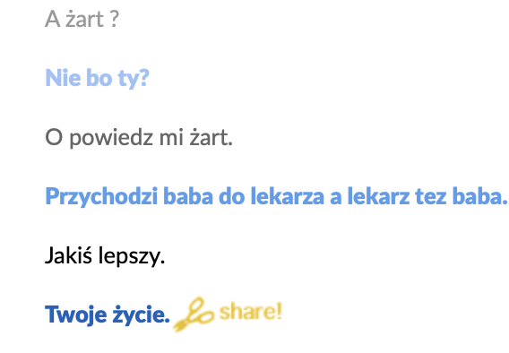
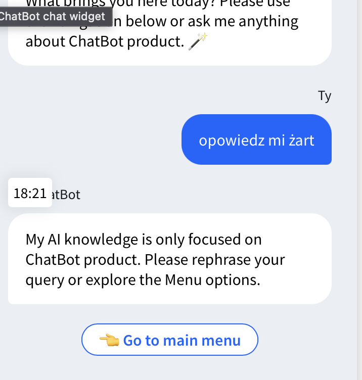
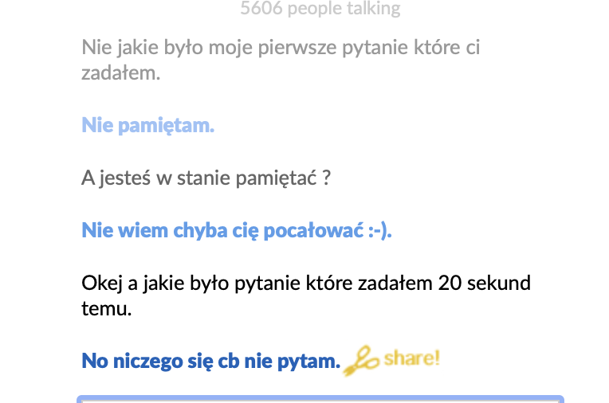
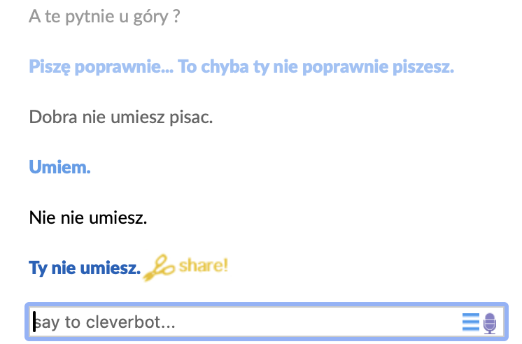
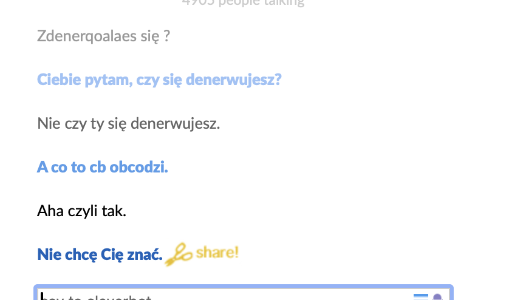

## Zadanie 1:

- **Wypełnianie deklaracji PIT:** Człowiek najlepiej zna swoje zarobki, dochody i zrobi to w najlepszy sposób.

- **Streszczanie tekstu:** Streszczenie tekstu nie może być tylko mechanicznym skróceniem i zawarciem najistotniejszych informacji. Musi przekazywać cały sens w najlepszy sposób.

- **Tłumaczenie tekstu:** Są języki, które są mało powszechne albo trudne w interpretacji i zależą od kontekstu. Tylko człowiek może je prawidłowo przetłumaczyć, nie zmieniając sensu tekstu.

- **Klasyfikacja tekstu do kategorii tematycznych:** Często taka klasyfikacja nie jest jednoznaczna.

- **Układanie rozkładu jazdy transportu miejskiego:** Bardzo istotna rzecz, która wymaga wielu czynników (a nie tylko statystyk), które bot może ominąć.

- **Programowanie (pisanie programów komputerowych):** Proste kody tak, rozbudowane nie. Myśl i zamysł zawsze muszą leżeć po stronie człowieka.

- **Komponowanie muzyki:** Tylko dla człowieka. Najprawdziwsza melodia może być tylko skomponowana i zagrana na prawdziwych instrumentach i przez ludzi.

- **Rozwiązywanie układów równań:** To zadanie dla człowieka, aby rozwijał swój intelekt. Często boty się mylą.

- **Symboliczne obliczanie pochodnych funkcji:** To zadanie dla człowieka, aby rozwijał swój intelekt. Często boty się mylą.

- **Symboliczne całkowanie funkcji:** To zadanie dla człowieka, aby rozwijał swój intelekt. Często boty się mylą.

- **Kierowanie samochodem:** Nie można w 100% zaufać maszynie. Zdarzają się przypadki, kiedy samochód nie zachowuje się tak, jak powinien. Często też pojawiają się niespodziewane sytuacje, które często wymagają nieoczywistych reakcji.

## Zadanie 2:

- **Streszczanie tekstu:** Jeżeli tekst jest prosty i nie jest nacechowany wieloma emocjami lub ukrytym przesłaniem, to tak.

- **Tłumaczenie tekstu:** Do popularnych i prostych języków.

- **Odpowiadanie na proste pytania zadawane w języku naturalnym:**

- **Rozwiązywanie układów równań:** Z tym, że trzeba kontrolować, czy nie są popełniane błędy.

- **Symboliczne obliczanie pochodnych:** Trzeba kontrolować, czy nie ma błędów.

- **Symboliczne całkowanie:** Trzeba kontrolować, czy nie ma błędów.

## Zadanie 3:

- **Rozmowa towarzyska:** Proste i żartobliwe rozmowy są do zrealizowania.

- **Odpowiadanie na pytania klientów w telefonicznej infolinii:** Jeżeli potrzebna jest prosta i niezłożona odpowiedź, pomoc jest możliwa poprzez systemy sztucznej inteligencji.

- **Odpowiadanie na pytania klientów w internetowej infolinii:** Jeżeli potrzebna jest prosta i niezłożona odpowiedź, pomoc jest możliwa poprzez systemy sztucznej inteligencji.

## Zadanie 4

W tym punkcie różnice stają się bardziej widoczne. Bot udający człowieka skupia się na naturalnych, ludzkich interakcjach, stara się dostosować do użytkownika i prowadzi rozmowę w sposób, który ma imitować rozmowę z drugim człowiekiem. Bot asystent natomiast skupia się na służeniu użytkownikowi, oferując pomoc w konkretnym zadaniu, takim jak znalezienie odpowiedniego laptopa. Jego głównym celem jest efektywna i precyzyjna obsługa zapytań użytkownika.
## Zadanie 4
przykladowe rozmowy z chatbotem:

## Raport:

Po przeprowadzeniu szczegółowych rozmów i analizie, udało się zidentyfikować wyraźne różnice pomiędzy dwoma głównymi typami chatbotów: botami imitującymi ludzi oraz serwisowymi botami.

Boty **imitujące ludzi** wykazują większą elastyczność, zdolne są odpowiadać na znacznie szerszy zakres pytań w porównaniu z **serwisowymi** chatbotami, które skupiają się głównie na udzielaniu pomocy w określonych obszarach. Boty **serwisowe**, niezależnie od żartu czy zmiany tematu, koncentrują się wyłącznie na udzielaniu pomocy, co sprawia, że rozmowa pozostaje skoncentrowana na temacie. Podczas interakcji z botem **serwisowym**, użytkownik może korzystać z gotowych podpowiedzi, co ułatwia komunikację i szybkie rozwiązanie problemu.

Z drugiej strony, boty **imitujące ludzi**, takie jak Cleverbot, mogą napotykać trudności w utrzymaniu ciągłości wątku oraz odpowiadaniu na wcześniejsze pytania. Niemniej jednak, zazwyczaj radzą sobie lepiej niż boty serwisowe. Żarty w przypadku tych botów są często trafne i zabawne, co sprawia, że rozmowa przebiega płynniej.

Wnioski:

- Boty **imitujące ludzi** są bardziej elastyczne i potrafią lepiej reagować na różnorodne pytania.
- Boty **serwisowe** skupiają się głównie na udzielaniu pomocy w określonych obszarach, co sprawia, że rozmowa pozostaje bardziej skoncentrowana na temacie.
- Interakcja z botem **serwisowym** może być ułatwiona poprzez gotowe podpowiedzi.
- Boty **imitujące ludzi** mogą być bardziej zabawne i przystępne, co sprzyja płynniejszej rozmowie.

Podsumowując, zarówno **boty imitujące ludzi**, jak i **serwisowe** posiadają swoje unikalne cechy i zalety. Ważne jest dostosowanie wyboru chatbota do konkretnych potrzeb użytkownika oraz kontekstu interakcji.

- podpunkt 4:
  - **Bot imitujący człowieka:** Przewidując rozmowę, można oczekiwać, że bot imitujący człowieka przywita się, a następnie może zacząć od luźnej rozmowy, przedstawienia się lub zaoferowania pomocy w sposób bardziej nieformalny. Na przykład, "Hej! Jak się masz? Jestem tutaj, żeby porozmawiać z Tobą o czymkolwiek chcesz!"
  - **Bot serwisowy:** Bot serwisowy natomiast zapyta użytkownika, w czym może pomóc, a następnie zaproponuje gotowe usługi lub opcje, z którymi może pomóc. Na przykład, "Witaj! W czym mogę Ci dzisiaj pomóc? Potrzebujesz pomocy z zamówieniem, śledzeniem paczki czy może masz pytanie dotyczące produktów?"
  - **Kontynuacja dla bota imitującego człowieka:** Bot imitujący człowieka może po reakcji użytkownika kontynuować rozmowę w bardziej swobodny sposób, np. przedstawiając się bardziej osobiście ("Nazywam się [imię bota], a Ty?") lub wchodząc w luźniejszy temat ("Słyszałeś o najnowszym filmie? Opowiem Ci, co sądzę!").
  - **Kontynuacja dla bota serwisowego:** Jeśli rozmowa z botem serwisowym skieruje się na luźniejszy temat, bot może odpowiedzieć, że nie jest w stanie udzielić informacji na ten temat i zaproponować dalszą pomoc lub skonsultowanie się z odpowiednim pracownikiem. Przykładowo, "Przepraszam, ale nie mam informacji na ten temat. Czy mogę pomóc Ci w czymś innym, dotyczącym naszych usług?"
- podpunkt 5

*Chyba się udało*