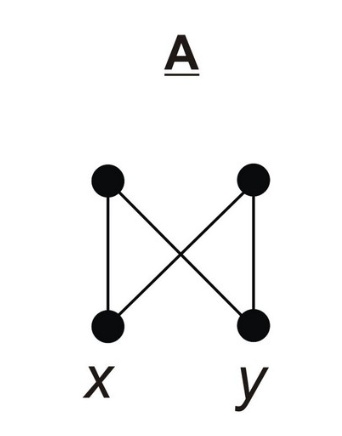
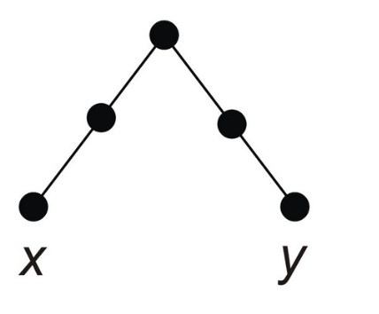
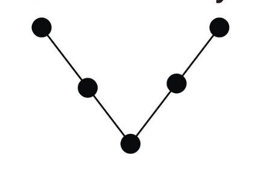
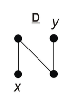
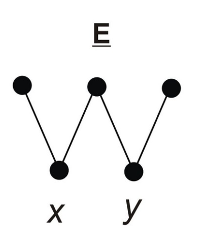
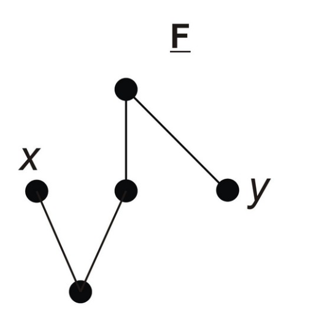
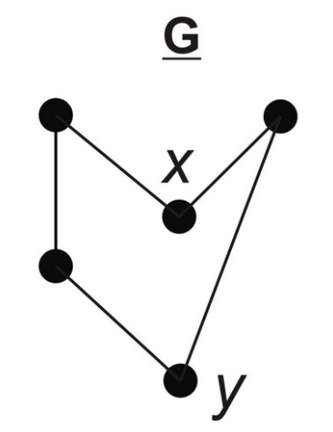

Zadanie 1.1

- A) x jest rodzenstwem y i na odwrot.

- B) x jest kuzynem y i na odwrot.

- C) to są dziadkowie tego samego wnuka.

- D) y to przybrany rodzic x, x jest przybranym dzieckiem y.

- E) x to przybrane rodzenstwo y i y to przybrane rodzenstwo x.

- F) x to szwagier/szwagierka y.

- G) x jest wspolnym znajomym y i na odwrot

Zadanie 1.2
***program:***

% Student exercise profile
:- set_prolog_flag(occurs_check, error).        % disallow cyclic terms
:- set_prolog_stack(global, limit(8 000 000)).  % limit term space (8Mb)
:- set_prolog_stack(local,  limit(2 000 000)).  % limit environment space

% Your program goes here
%baza
rodzic(krzysztof,krystian). %Pierwsze jest rodzicem drugiego
rodzic(beata,krystian).
rodzic(krzysztof,wiktor).
rodzic(beata,wiktor).
rodzic(bronislaw,krzysztof).
rodzic(krystyna,krzysztof).
rodzic(bronislaw,malgorzata).
rodzic(krystyna,malgorzata).
rodzic(malgorzata,dawid).
rodzic(malgorzata,bartek).
rodzic(zbyszek,beata).
rodzic(hanna,beata).
rodzic(pani,krzysztof).
rodzic(krzysztof,corka).
rodzic(pani,corka).
rodzic(grzegorz,dawid).
znajomy(dawid,kolega).
znajomy(kolega, pawel).
znajomy(pawel,dawid).
%reguly:

rodzenstwo(X, Y) :-
    rodzic(Z, X),  % Z jest rodzicem X
    rodzic(Z, Y),  % Z jest również rodzicem Y
    X \= Y.       % X nie jest takie same jak Y

kuzyn(X, Y) :-
    rodzic(Z, X),       % Z jest rodzicem X
    rodzic(W, Y),       % W jest rodzicem Y
    rodzenstwo(Z, W),   % Z i W są rodzeństwem
    X \= Y.             % X nie jest takie samo jak Y
dziadkowie_wnuka(X,Y) :-
    rodzic(X,A), rodzic(Y,B), %X jest rodzicem A, Y rodzicem B
    rodzic(A,W), rodzic(B,W), %A jest rodzicem W i B jest rodzicem W
    X \= Y, 
    A \= B.
macocha_ojczym(X, Y) :-
    rodzic(D, Y),               % D jest rodzicem Y
    rodzic(D, Q),               % D jest również rodzicem Q
    rodzic(X, Q),               % X jest rodzicem Q
    D \= X,                     % D nie jest tą samą osobą co X
    \+ rodzic(X, Y),            % X nie jest rodzicem Y
    X \= Q,                     % X nie jest tą samą osobą co Q
    Q \= Y.                    % Q nie jest tą samą osobą co Y
przybrane_rodzenstwo(X,Y) :-
    rodzic(M,X), rodzic(P,Y),
    rodzic(D,X), rodzic(D,Y),
    \+rodzic(P,X),
    \+rodzic(M,Y),
    M \= P,
    D \= M,
    P \= D,
    Y \= X.
szwagrostwo(X,Y) :-
    rodzenstwo(Y,R),    %D to wspolne dziecko  R i X
    rodzic(R, D),       
    rodzic(X, D),    
    R \= X,             % R nie jest tą samą osobą co X
    Y \= D,             % Y nie jest tą samą osobą co D
    X \= Y.            % X nie jest tą samą osobą co Y
wspolni_znajomi(X, Y, Z) :-
    znajomy(X, Y),     
    znajomy(Y, Z),      
    X \= Y,             
    Y \= Z,            
    X \= Z.     
        

    
    
    
    

    

/** <examples> Your example queries go here, e.g.
?- member(X, [cat, mouse]).
*/

Zadanie 2
***program2***
% Student exercise profile
:- set_prolog_flag(occurs_check, error).        % disallow cyclic terms
:- set_prolog_stack(global, limit(8 000 000)).  % limit term space (8Mb)
:- set_prolog_stack(local,  limit(2 000 000)).  % limit environment space

% Your program goes here
%baza
parent(beata, krystian).
parent(beata, maja).
parent(beata,wiktor).
parent(krzysztof, krystian).
parent(krzysztof,wiktor).
parent(krzysztof,piotrek).
parent(krzysztof,maja).
parent(alicja,piotrek).
parent(bronek,malgosia).
parent(bronek,krzysztof).
parent(krystyna, krzysztof).
parent(krystyna, malgosia).
parent(malgosia, dawid).
parent(wiktor,iga).
parent(ola,iga).

male(piotrek).
male(wiktor).
male(krystian).
male(krzysztof).
male(dawid).
male(bronek).

person(krystyna).
person(maja).
person(beata).
person(malgosia).
person(ola).

%reguly:
female(X) :-
    \+male(X).
    
father(X,Y) :-
   parent(X,Y),
   male(X),
   X \= Y.
mother(X,Y) :-
    parent(X,Y),
    female(X),
    X \= Y.
daughter(X,Y) :-
    female(X),
    parent(Y,X),
    \+male(X).
brother(X,Y) :-
    male(X),
    father(D,X), father(D,Y),
    mother(M,X), mother(M,Y),
	X \= Y.
sister(X,Y) :-		%na potrzeby zeby bylo latwiej
    female(X),
    father(D,X), father(D,Y),
    mother(M,X), mother(M,Y),
	X\=Y.
step_brother(X, Y) :-
    (
        (father(D, X), father(D, Y), \+ (mother(M, X), mother(M, Y)));
        (mother(M, X), mother(M, Y), \+ (father(D, X), father(D, Y)))
    ),
    X \= Y.
cousin(X, Y) :-
    parent(R, X),
    parent(Q, Y),
    (sister(Q, R); brother(Q, R)),
    Q \= R. % uniknięcie sytuacji, gdy sprawdzamy, czy osoba jest kuzynem samej siebie
grandfather_from_father_site(X,Y) :-
    father(X,D),father(D,Y),
	X\= Y,
	D\=Y,
	X\=D.
grandfather_from_mother_site(X,Y) :-
    father(X,M), mother(M,Y),
	X \= M,
	Y \= M,
	X \= Y.
grandfather(X,Y) :-
    (   grandfather_from_father_site(X,Y);
    grandfather_from_mother_site(X,Y)),
    X \= Y.
grandmother(X,Y) :-
    (   mother(X,D),father(D,Y); mother(X,M),
        mother(M,Y)),
    X \= Y.
granddaughter(X,Y) :-
    female(Y),
    (   grandfather(X,Y);grandmother(X,Y)),
    X \= Y.
ancestor2(X,Y) :-
      (   grandfather(X,Y);grandmother(X,Y);
    	father(X,Y);mother(X,Y)),
    X \= Y.
ancestor3(X,Y) :-
   (    (   father(X,G),grandfather(G,Y);
    mother(X,M),grandfather(M,Y);
    father(X,Q),grandmother(Q,Y);
    mother(X,R),grandmother(R,Y));
    (   grandfather(X,Y);grandmother(X,Y);
    	father(X,Y);mother(X,Y))),
    X \= Y.
    
    

/** <examples> Your example queries go here, e.g.
?- member(X, [cat, mouse]).
*/

